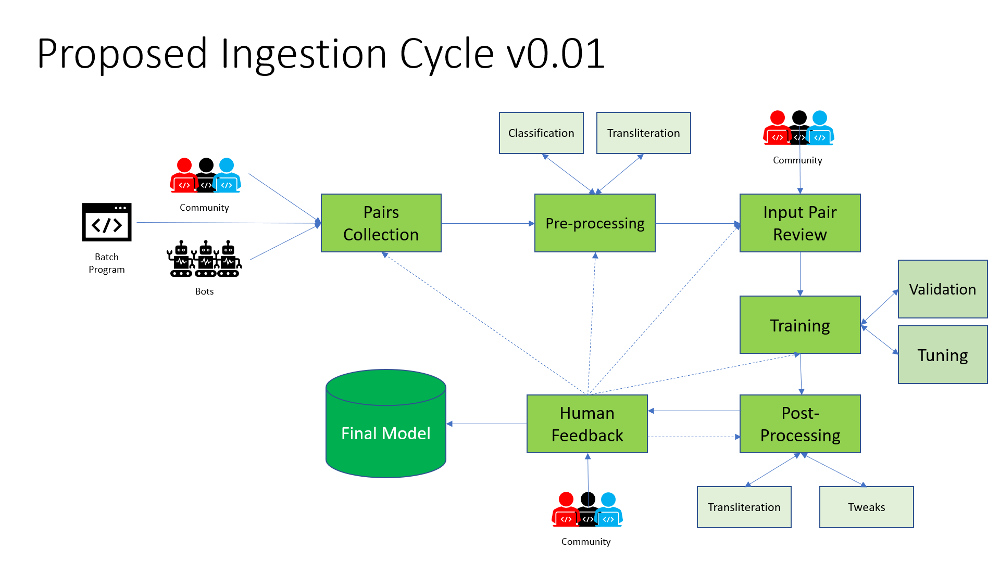

# Machine Translation Flow Pipeline
### Update log
- Date | Version | Author | Change details  
- 22nd Sept'19 | 0.01 | Soumendra Kumar Sahoo | Initial draft created

## Objective
This document explains to various pipeline flows for training and querying of English to Odia the translation.
I have tried to explain the concepts as low level as possible for an amateur technical person.

## Important Terms
- **Parallel pairs**:  English and Odia text pairs with same meaning.
- **Corpus**: A Data set with relevant text data
- **Translation**: Converting meaning of a text in one language to another language.
- **Transliteration**: Converting pronunciation of a text from one language to another.
- **Machine Translation**: Automatic Machine learning based translation
- **Phrase**: Part of a sentence without any particular meaning.
- Neural Machine Translation: Deep learning based automatic machine translation.
- **Agent**: Bot.
- **Crawler**: Move from one website to another website like a Spider.
- **Domain**: Business level like Healthcare, IT, Tourism, Religious text, etc.
- **POS tags**: Part of speech tags like Noun, Verb etc.
- **NER**: Named Entity Recognition like Person, Organization, Place, etc.
- **Parse**: Extracting information

The entire pipeline can be divided into two parts:  
1. Ingestion &
2. Querying

## Ingestion
Inserting parallel pairs to create the Machine Learning model. You can checkout the following diagram for the entire flow of the Ingestion pipeline.

### Data Collection
This part deals with collecting data from multiple sources. The data can be processed parallel pairs or in raw format. In a high level classification let us divide the process into three parts:

1. Continuous data collectors or Active Agents &
2. One time/Batch data collectors
3. Community generated corpus

#### 1. Active Agents/Bots
Agents means Bots, which will be running continuously 24x7 or a specific period of time to find out prospective parallel pairs. There can be many types of Agents:

1. News website crawlers  
*: Collecting and matching the headlines/content of the News websites across En and Or*
2. Localized website crawlers  
*: Websites which are translated into English as well as Odia*
3. Social Media Tweets/Posts across Twitter/Facebook.  
*: People posting Tweets/Posts in social media across multiple languages*
##### Process
It may consists of the following steps:  
1. Get a list of prospective 
   1. News websites
   2. Localized Websites &
   3. Social media Accounts
2. Crawl through the content from present to past posts.
3. Detect Odia text  
   *We can write an Odia Matra detector*
4. Detect the parallel English text. This can be achieved by:
   1. Matching Dictionary based words
   2. Followed by sentences
   3. Transliteration can help here too to match the Pronouns.

#### 2. Batch data collectors
The cases where we will get the data from a specific location that needs to be accessed for a short time period until we collect the entire data. This may be an one time activity or long source data refresh period. For example:

1. Wikipedia Dumps  
*: Wikipedia generates En-Or paragraph aligned dumps every week.*
3. Open sourced repositories/papers describing the location to collect the data

##### Process
The detecting of the data set is completely manual process. There is no need of automate that also. May be for the Wikipedia dump we can run an Agent in a weekly schedule to get only the incremental data.  
The flow will be:  
1. manually detect the data set
2. Write a Data collector to get the data from the location or manually download the data set from that location.

That's it. The Data collector work is done.
#### 3. Community generated corpus
Other than the above two methods of collecting the data. We will need help from the community to manually prepare the data. We may need data in following categories:
1. Parallel pairs
2. Parallel pairs with POS tags &
3. Parallel pairs with Named Entity Recognition (NER) data
4. Parallel pairs with domain classification

These are not distinct categories. That means Parallel pairs are mandatory to provide. The rest all POS, NER and Domain are optional. If community can provide pairs with all POS, NER and Domain, that data will be treated as pure Gold.  
The format to collect the POS, NER and Domain information yet to be decided.

### Data Preprocessing
The data we receive in the Collection phase are most likely not in the desired format and needs to be processed with additional metadata information to bring the collections into a standard format. These methods to convert raw data into standard format will happen at this stage.

There are many crucial steps:  
1. Data License verification
2. Data cleaning
   1. HTML/CSS tags removal
   2. Punctuation removal
   3. English word removal from the Odia part of the pair
3. Alignment (Phrase, Sentence, Paragraph)
4. Metadata generation/addition
   1. POS tags
   2. NER
5. Filtering out the pairs based on a threshold.
6. Classification
   1. Business domain based (IT, Religion, Tourism, Politics, etc.)
   2. Morphology based (Word, Phrase, Sentence, Paragraph, etc.)
7. Converting the input raw format into standard format

Let is go though these steps individually:
#### 1. Data License verification
1. The data which we will receive through the Data collectors need to be checked.
2. Provide proper Attributions wherever needed.
3. Weed out the corpus where proper license is not there.
4. Contact the original authors in case needed.

Licensing is a crucial thing in Open source projects. Therefore, should not be taken lightly. Legal obligations may need to be faced if not handled smartly.

#### 2. Data Cleaning
The data we received need to go through a set of cleaning steps before going further.  
1. Remove duplicates from the corpus.
2. For the initial days, we may need to remove the punctuation marks from the pairs. later on during tune up we may need to enable the punctuation marks.
3. HTML and CSS tags are definitely need to be removed. A program can be written for this.
4. It may occur that there might be English words present in the Odia part of the pair. May be due to Brand name or Trademark. In these cases we may need to use 
   1. Keep it as it is (Recommendation) or
      1. NER and POS will come into the picture here.
      2. it will identify if the English word is a Pronoun.
      3. If Yes, keep it, else try out other two options.
   2. Transliteration to substitute the English word into Odia.
   3. Remove that sentence
5. Again remove duplicates from the corpus. In fact we should remove duplicates after each step to reduce the workload on the next steps.

#### 3. Data Alignment
Alignment of the pairs is the crucial part of this process. An entire codebase can be written to align the pairs. We have thousands of corpus lying around unusable due to this Alignment issue. The Alignment can be done based on the original text Morphology.
1. A dictionary based approach (matching words across the pairs) might be tried to align the sentences. However a strong plan needs to be created.

#### 4. Metadata addition
Odia does not have any open source free auto POS tagger or NER taggers. There is word2vec present, which I need to test though. In combination of these features the translation accuracy will shoot up.  
For this I has asked these info from the community in the Data collection phase.

#### 5. Threshold Filtering
After all these steps there will be a threshold set to analyze the validity and uniqueness of the pair.
The threshold can be set based on:  
1. Number of minimum letters need to be present in a sentence pair.
2. Number of minimum words need to be present in a sentence pair.
3. Percentage of English letters in an Odia part of the pair.
4. Minimum number of high weight POS tags like Nouns/Adjectives/Pronouns/Verbs needed to be declared as a valid pair.

If any pair unable to pass any of the above conditions, should be filtered out.

#### 6. Classification of the pairs
##### 1. Business domain based
We can not make a swiss army knife for any kind of translation done by a generic model. We have to find our niche domain. For the initial stage it may be the domain on which we get the maximum number of pairs.  
This concept is very critical and need to understood at early stage. You can not train with Agriculture data and want to test those with Medical terms. The result will be pathetic.  
Thats why those MT models who grow initially pick a specific sector and specialize on that first. If we need to specialize in generic Hi, Bye terms we need to weed out the other domain specific data pairs.  
Due to this reason the domain based classification is critical during the processing phase both for the MT model and business too.  

##### 2. Morphology based
We need to classify the pairs into words, phrases and sentences.

#### Raw --> Standard
Convert the format to standard format and make any changes if needed to the data which will be used further on the training process.

## Query
Checking:
- Check the minimum number of letters/words/POS tags
- Likelihood of finding a translation
  - Depends on many parameters
-  